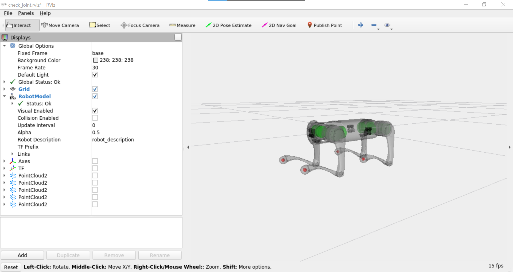
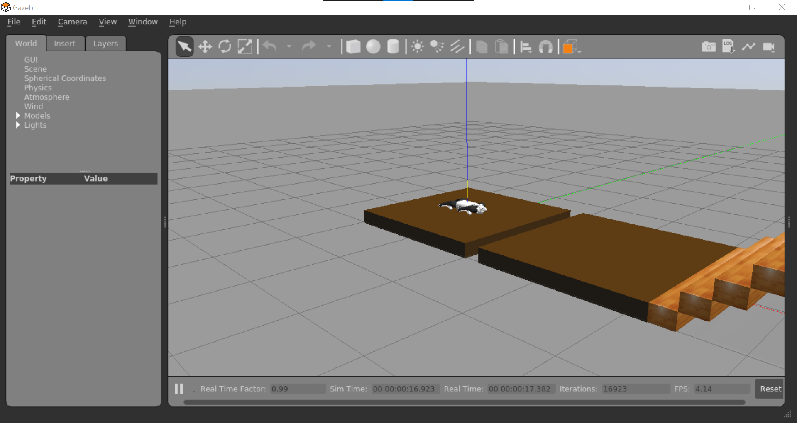
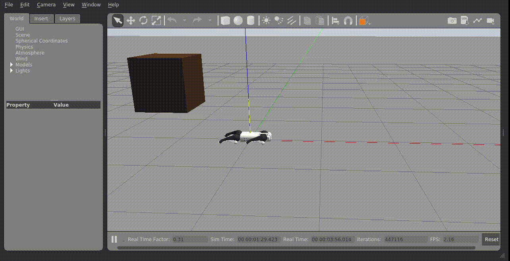
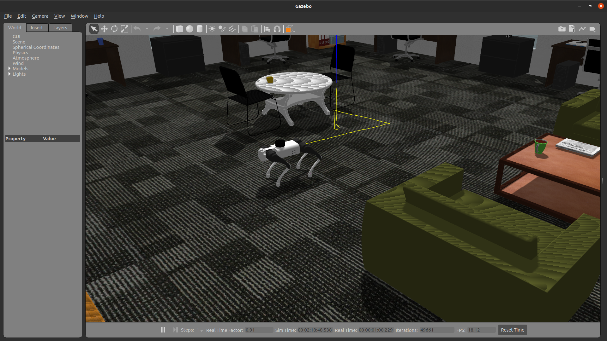
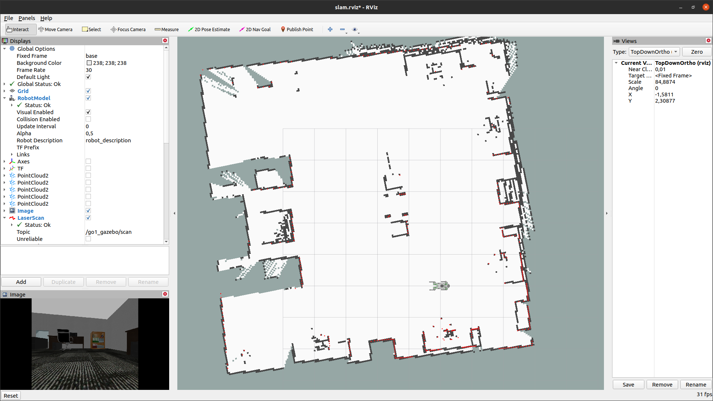

# Introduction
This repository is based on Unitree's repositories and aims to add the compatibility of the ROS packages with ROS Noetic. The list of the repositories considered is the following:
* [unitree_ros](https://github.com/unitreerobotics/unitree_ros)
* [unitree_ros_to_real](https://github.com/unitreerobotics/unitree_ros_to_real) (only the package `unitree_legged_msgs`)
* [unitree_guide](https://github.com/unitreerobotics/unitree_guide)

The repository contains all the necessary packages to run a simulation with Unitree robots. You can load robots and joint controllers in Gazebo and you can move the robot in the environment. There are also packages that enable SLAM and navigation functionalities.

# Dependencies
* [ROS Noetic](https://www.ros.org/)
* [Gazebo](http://gazebosim.org/)

# Build

For ROS Noetic:
```
sudo apt-get update
sudo apt-get install liblcm-dev
sudo apt-get install ros-noetic-controller-interface ros-noetic-gazebo-ros-pkgs ros-noetic-gazebo-ros-control ros-noetic-joint-state-controller ros-noetic-effort-controllers ros-noetic-joint-trajectory-controller ros-noetic-amcl ros-noetic-move-base ros-noetic-slam-gmapping ros-noetic-hector-slam ros-noetic-map-server ros-noetic-global-planner ros-noetic-dwa-local-planner
```

Clone this repository in the `src` folder of your catkin workspace:
```
git clone https://github.com/macc-n/ros_unitree
```

And open the file `unitree_ros/unitree_gazebo/worlds/stairs.world`. At the end of the file (line 112):
```
<include>
    <uri>model:///home/unitree/catkin_ws/src/ros_unitree/unitree_ros/unitree_gazebo/worlds/building_editor_models/stairs</uri>
</include>
```
Please change the path of `building_editor_models/stairs` to the real path on your PC.

Then you can use `catkin_make` to build:
```
cd ~/catkin_ws
catkin_make
```

If you face a dependency problem, you can just run `catkin_make` again.

# Robots Description
The description of robots Go1, A1, Aliengo, and Laikago. Each package includes mesh, urdf and xacro files of robot. Take Go1 for example, you can check the model in Rviz by:
```
roslaunch go1_description go1_rviz.launch
```


# Start the Simulation
Open a terminal and start Gazebo with a preloaded world:
```
roslaunch unitree_gazebo robot_simulation.launch rname:=go1 wname:=earth
```
Where the `rname` means robot name, which can be `laikago`, `aliengo`, `a1` or `go1`. The `wname` means world name, which can be `earth`, `space` or `stairs`. And the default value of `rname` is `go1`, while the default value of `wname` is `earth`. In Gazebo, the robot should be lying on the ground with joints not activated.



For starting the controller, open a new terminal, then run the following command:
```
rosrun unitree_guide junior_ctrl
```
After starting the controller, the robot will lie on the ground of the simulator, then press the '2' key on the keyboard to switch the robot's finite state machine (FSM) from Passive(initial state) to FixedStand, then press the '4' key to switch the FSM from FixedStand to Trotting


Now you can press the 'W', 'A', 'S', 'D' keys to control the translation of the robot, and press the 'J', 'L' keys to control the rotation of the robot. Press the 'Spacebar', the robot will stop and stand on the ground. If there is no response, you need to click on the terminal opened for starting the controller and then repeat the previous operation.



The full list of transitions between states available is the following:
* Key '1': FixedStand/FreeStand to Passive
* Key '2': Passive/Trotting to FixedStand
* Key '3': Fixed stand to FreeStand
* Key '4': FixedStand/FreeStand to Trotting
* Key '5': FixedStand to MoveBase
* Key '8': FixedStand to StepTest
* Key '9': FixedStand to SwingTest
* Key '0': FixedStand to BalanceTest

# Gazebo Worlds

The worlds included in this repository are simple worlds and they should be used for dedug purposes. If you want to add more realistc worlds, you can clone the repository [gazebo_worlds](https://github.com/macc-n/gazebo_worlds).
After following the instructions for the usage, you can specify which world you want to load with the argument `wname`:

```
roslaunch unitree_gazebo robot_simulation.launch rname:=go1 wname:=office_small
```



# Mapping

Start the simulation in Gazebo:
```
roslaunch unitree_gazebo robot_simulation.launch rname:=go1 wname:=office_small rviz:=false
```

Start the robot controller:
```
rosrun unitree_guide junior_ctrl
```

Start the mapping process with gmapping:
```
roslaunch unitree_navigation slam.launch rname:=go1 rviz:=true algorithm:=gmapping
```
Alternatively, you can start the mapping with hector:
```
roslaunch unitree_navigation slam.launch rname:=go1 rviz:=true algorithm:=hector
```
In the terminal of the robot controller, press the keys '2' and '4' to set the robot in trotting mode, then, move the robot around the environment to create the map.

During the mapping process, Rviz should show something similar to the following screehshot:


Save the map:
```
rosrun map_server map_saver -f ~/catkin_ws/src/ros_unitree/unitree_guide/unitree_navigation/maps/office_small
```

# Navigation
Start the simulation in Gazebo:
```
roslaunch unitree_gazebo robot_simulation.launch rname:=go1 wname:=office_small rviz:=false
```

Start the robot controller:
```
rosrun unitree_guide junior_ctrl
```
and press the keys '2' and '5' to activate the MoveBase mode.

Start the navigation stack:
```
roslaunch unitree_navigation navigation.launch rname:=go1 map_file:=/home/unitree/catkin_ws/src/ros_unitree/unitree_guide/unitree_navigation/maps/office_small.yaml
```

In Rviz, first set the initial position of the robot with the "2D Pose Estimate" button. Next, set a navigation goal with the "2D Nav Goal" button.


# Note
If you are having problems with the movements of the robot and the node junior_ctrl logs the following error:
```
[ERROR] Function setProcessScheduler failed.
```
Yo should consider to edit the file `/etc/security/limits.conf` and add the following two lines:
```
<username> hard rtprio 99
<username> soft rtprio 99
```
Replace `<username>` with your username.
Save, close the file and reboot the system to apply the changes.

---

# From Original Repository

# Detail of Packages
## unitree_legged_control:
It contains the joints controllers for Gazebo simulation, which allows users to control joints with position, velocity and torque. Refer to "[unitree_ros/unitree_controller/src/servo.cpp](https://github.com/unitreerobotics/unitree_ros/blob/master/unitree_controller/src/servo.cpp)" for joint control examples in different modes.

## unitree_gazebo & unitree_controller:
You can launch the Gazebo simulation with the following command:
```
roslaunch unitree_gazebo normal.launch rname:=a1 wname:=stairs
```
Where the `rname` means robot name, which can be `laikago`, `aliengo`, `a1` or `go1`. The `wname` means world name, which can be `earth`, `space` or `stairs`. And the default value of `rname` is `laikago`, while the default value of `wname` is `earth`. In Gazebo, the robot should be lying on the ground with joints not activated.

### 1. Stand controller
After launching the gazebo simulation, you can start to control the robot:
```
rosrun unitree_controller unitree_servo
```

And you can add external disturbances, like a push or a kick:
```
rosrun unitree_controller unitree_external_force
```
### 2. Position and pose publisher
Here we demonstrated how to control the position and pose of robot without a controller, which should be useful in SLAM or visual development.

Then run the position and pose publisher in another terminal:
```
rosrun unitree_controller unitree_move_kinetic
```
The robot will turn around the origin, which is the movement under the world coordinate frame. And inside of the source file [move_publisher.cpp](https://github.com/unitreerobotics/unitree_ros/blob/master/unitree_controller/src/move_publisher.cpp), we also provide the method to move using the robot coordinate frame. You can change the value of `def_frame` to `coord::ROBOT` and run the catkin_make again, then the `unitree_move_publisher` will move robot under its own coordinate frame.

## z1_controller

You can launch the z1 Gazebo simulation with the following command:

```
roslaunch unitree_gazebo z1.launch
```

After launching the gazebo simulation, you can start to control the z1 robot by z1_sdk.  
see [z1_documentation](dev-z1.unitree.com/5-sdk/run.html)  
You can also send ros commands directly to z1 robot:
```
rosrun z1_controller unitree_move_z1
```
